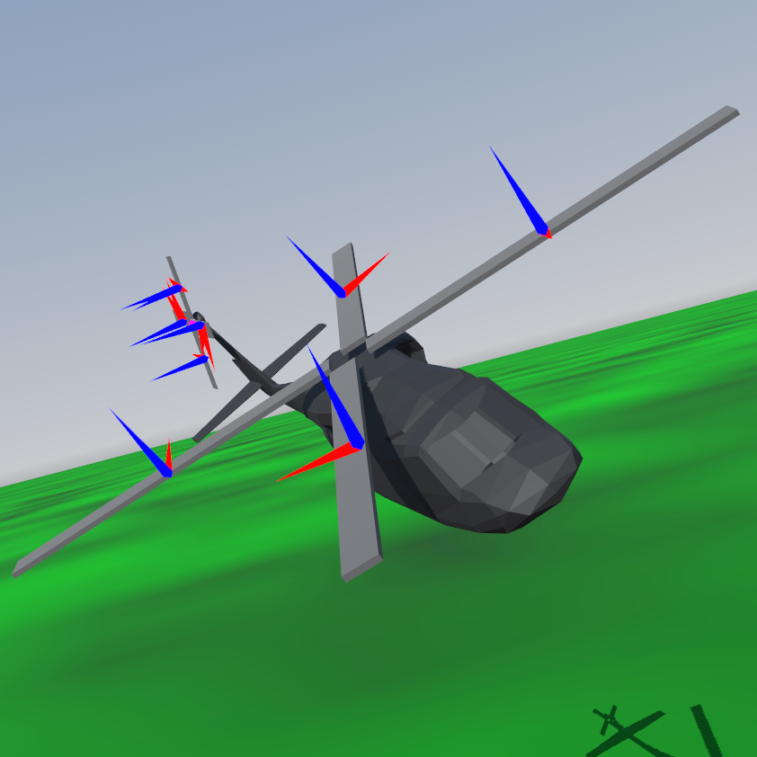

# Godot Aerodynamic Physics

# For Godot Asset Library downloads.
1. Ensure that addon files are installed inside `res://addons/godot_aerodynamic_physics`

# Manual Installation
1. Download and un-zip files.
2. Place the `godot_aerodynamic_physics` folder inside your project's `addons` folder.
3. Enable plugin in project settings `Project > Project Settings > Plugins`

# Usage
Tutorial available [here](https://youtu.be/iI8SXQdaqDQ)
1. Add an  AeroBody to your scene, and add one or more  AeroInfluencer3D derived classes as children, adjust settings to change the characteristics.

# Development Direction
1. Usability, stability, and performance.
2. More AeroInfluencer3D derived nodes (Dynamic rotor systems, primitive shapes).
3. Preset profiles for AeroSurface nodes.
4. Energy–maneuverability performance profiling.
