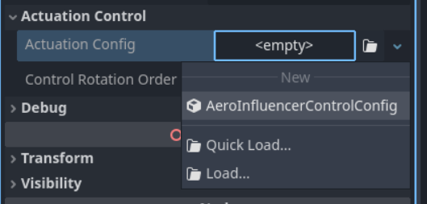

# Getting Started

If you haven't already, [Install the plugin](/README.md/#installation)

## Basic AeroBody3D
The minimum requirement for an AeroBody3D is:
- A child `CollisionShape3D` with a valid Shape

Aerodynamic effects will only be calculated if there is one or more child `AeroInfluencer3D`-type nodes (i.e. `ManualAeroSurface3D`)
- Basic [drag-ball example](https://github.com/addmix/godot_aerodynamic_physics/tree/main/demo/aircraft_examples/drag_ball)

## Glider example

### A basic glider can be constructed with 4 AeroSurface nodes.
- Right Wing
- Left Wing
- Elevator (horizontal tail)
- Rudder (veritcal tail)

> Make sure that the mass of the AeroBody is reasonable. If the mass of the AeroBody is too low, it can cause the simulation to lose stability, resulting in extreme oscillations, or simulation explosions.

> Similarly, ensure the CollisionShape properly covers the AeroSurfaces. A too-small CollisionShape will influence the accuracy of the simulation, and in extreme cases, cause the same oscillation and explosion problems of low mass. 

### CSGBox3D nodes can be used to create a simple plane model that is visible in game.

(insert picture here)

### Balancing the glider

- Enable the debug visibility (`AeroBody3D.show_debug = true`) to view the center of mass (yellow checker diamond [I want a yellow checker icon here]) and the center of lift (light-blue checker line [I want a blue checker line icon here]).

- Adjust the AeroSurfaces until the center of lift is slightly above, and slightly behind the center of mass

(insert picture/gif here)

> The rule of thumb is that the center of lift should be slightly behind, and slightly above the center of mass. [Why?](../advanced_concepts/aerodynamic_design.md/#static-stability)

To improve the uncontrolled behavior of the glider, a slight rotation of the wings to "tilt up" (also called a [dihedral angle](../advanced_concepts/aerodynamic_design.md/#dihedral-angles))

(insert picture/gif here)

### Controlling the glider

The Godot Aerodynamic Physics plugin comes with a powerful input configuration system for AeroBody3D nodes. To access this control system, add an `AeroControlComponent` node as a child of your AeroBody3D.

By default, the AeroControlComponent is configured to use the arrow keys for pitch and roll using the `ui_*` input events. It is highly recommended to [change these input events](https://docs.godotengine.org/en/latest/tutorials/inputs/input_examples.html#inputmap) to game-specific input events, such as `pitch_up`, `pitch_down`, `roll_left`, etc. 

Now that the AeroControlComponent is added to the glider, and the inputs are configured, the control component will inject inputs into the AeroBody. We still must configure how AeroInfluencers will behave in response to those inputs.

- Create a new ControlConfig in the AeroSurface's `actuation_config` property.

- First, decide a maximum angle (in radians) that you want this AeroInfluencer to be able to rotate. In most cases with AeroSurfaces, you will want this rotation on the X axis.

- Next, we have to connect the control input to this rotation. To do so, expand the `axis_configs` array, and press "+ Add Element" to create a new AxisConfig.

- This AxisConfig may seem daunting, but it's surprisingly simple. `axis_name` will be the name that matches the axis name inside the AeroControlConfig, (e.g. `pitch`). 
- The `contribution` determines what percentage (-1.0 to 1.0) of the `max_value` rotation to apply for this input. For traditional airplanes, this should be -1.

Now, as you run the project, the AeroSurface should rotate in response to pitch inputs. This same methodology can be used for yaw and roll inputs on the other AeroSurface nodes.

### Differential control and axis-flip

Controls like roll are considered "differential controls", meaning that two opposed control surfaces must have opposite control directions. As this is a fairly common case, the control system has an "axis flip" feature, that can be configured to flip the direction of a given control on a given axis.

- In the example of roll, it can be configured like this:

> This works by defining that the X contribution should have it's direction flipped depending on it's relative X position to the center of mass of the AeroBody. If you had control surfaces for roll on the top and bottom of an aircraft, you would need to swap this X for a Y.

### Powered flight

The plugin also includes an `AeroThruster3D` node, which acts as a simple force thruster.

> By default, thruster nodes are configured to thrust in their local -Z direction, taking inputs from the `throttle` control axis.

- Configure the thrust force of the AeroThruster3D, under the "Simulation Parameters" category, using the `max_thrust_force` property. 1 kilo-newton == 1,000 newtons. The default value is 10kn. The default throttle input events are `ui_page_up` and `ui_page_down`.

## Configuring Flight Assist

Make sure your aircraft flies acceptably *before* trying to configure flight assist. Flight assist isn't magic, and most-likely won't be able to solve the instability present in your aircraft.

- In the `AeroControlComponent`, click on the empty `flight_assist` property, and create a new flight assist.

The flight assist has many different options to customize many different features. For basic flight assist/stability assist, there are only 3 sections that will be relevant.

### Max Angular Rates

The max angular rates determine the maximum desired turn speed (in radians per second) for each axis. These values aren't the most important for handling, unless you have a large aircraft that necessitates reduced maximum turn rates. For everything else, the default values should be reasonable enough.

### Angular Rate Tracking

The angular rate tracking PIDs are the core functionality of the flight assist. They accomplish this by comparing the AeroBody's angular velocity with the control input's desired angular velocity, determining the "error", and providing a control command that drives the error towards 0.

The default values should provide guidance on how these PIDs should be generally configured. However, tuning will be necessary to avoid oscillations and provide the maximum responsiveness of your aircraft.

### General tuning guidance:
- Slow oscillations: 
    - Ensure `clamp_integral` is enabled, and the limits are within reason (usually around -0.1 to 0.1)
    - increase P
    - decrease I
- Fast/violent oscillations:
    - Reduce D (typically, D should not be used on angular PIDs for aircraft)
    - Reduce P
- Aircraft doesn't hit G limit.
    - Increase I
    - Increase min/max integral error
- Aircraft is slow to hit G limit.
    - Increase I
    - Decrease min/max integral error

> For more information on PIDs and how they work, check out the [Control Theory](../advanced_concepts/control_theory.md) docs page.

### AOA Limiter

The AOA limiter serves to prevent the aircraft from stalling, by reducing the control command when the aircraft reaches high angles of attack. With default lift/drag curves, the default values should suffice, though they can be decreased if an aircraft still has a tendency to stall and lose control due to high angle of attack.

## Further reference
[Getting familiar with Aero Nodes](getting_familiar_with_aero_nodes.md)