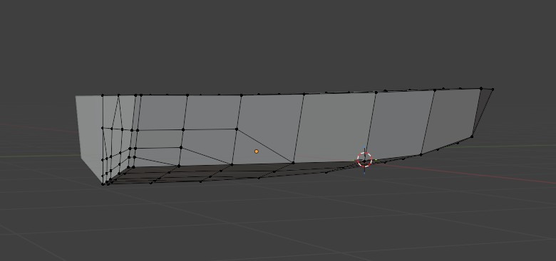
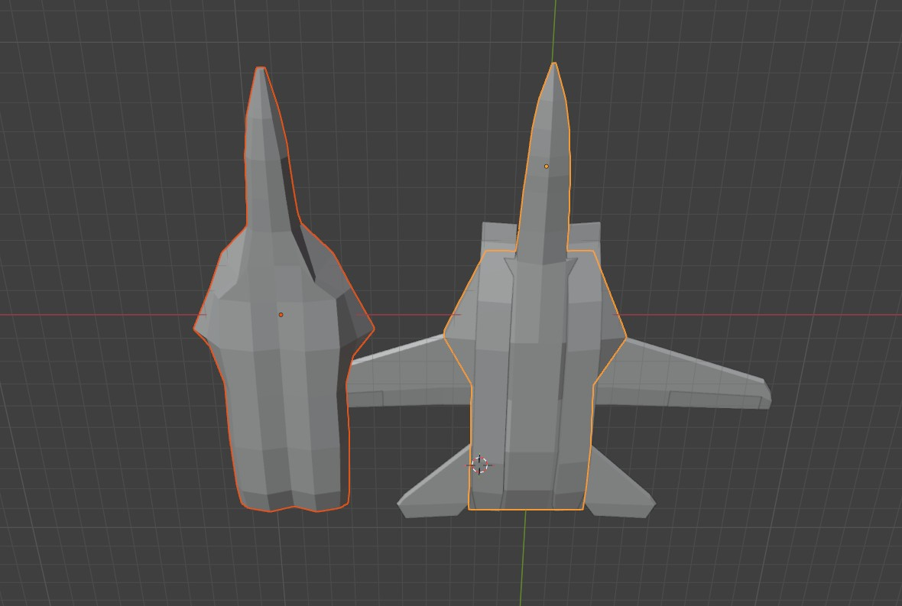
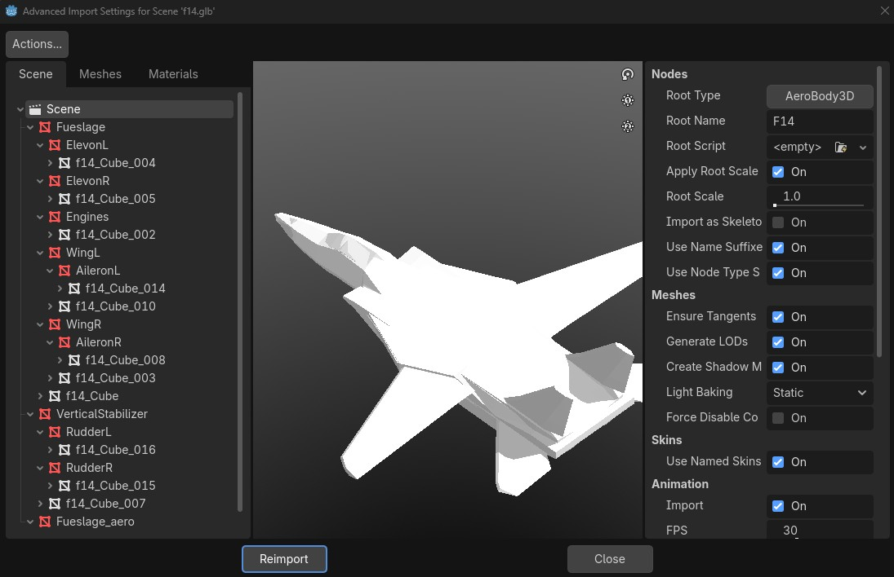
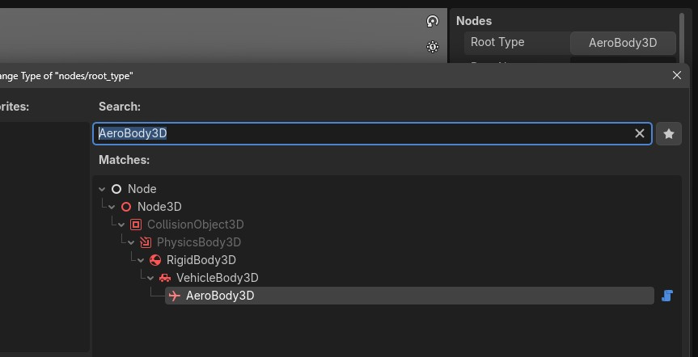
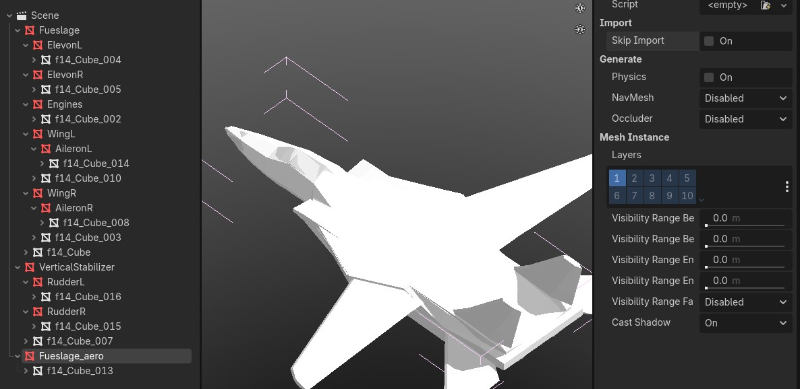
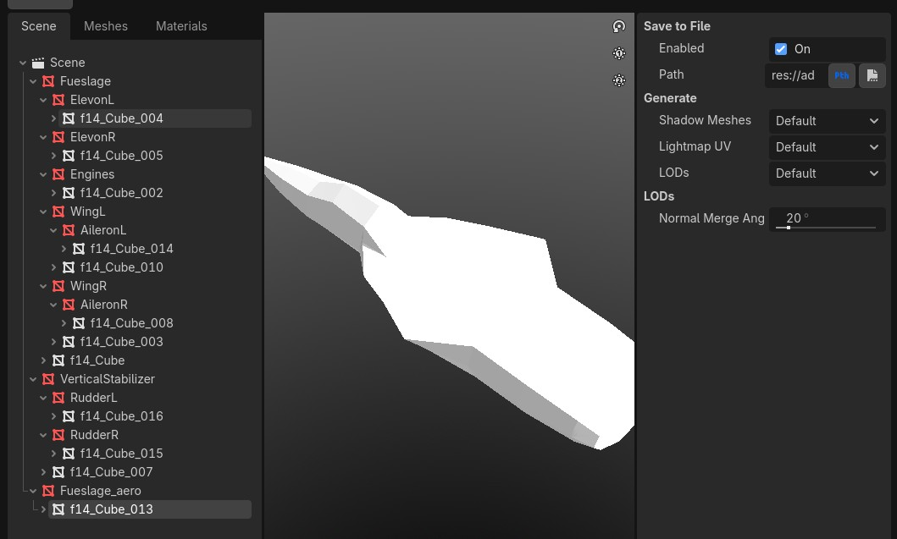
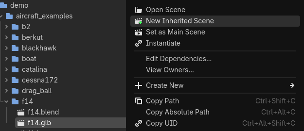
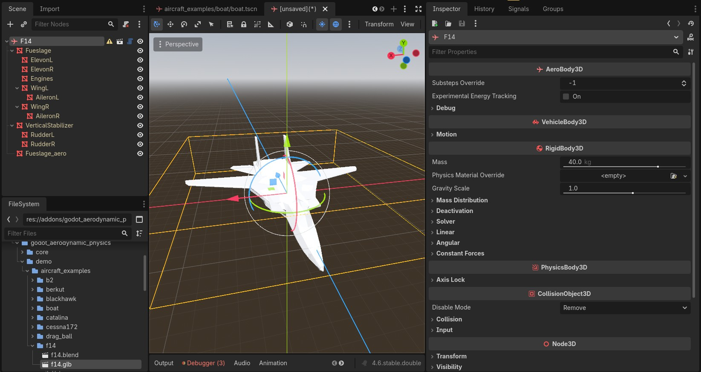
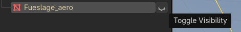
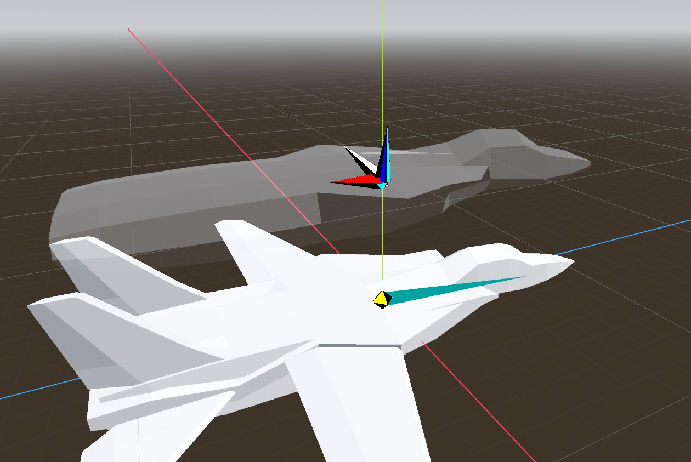

# Using AeroAtmosphere3Ds

AeroAtmosphere3Ds have 3 main properties:

- Wind
- Density
- Temperature (mostly unused)

The demo scene has both water and wind configured, which is a good place to start.

## Workflow for creating an AeroBody3D scene with 1 or more AeroBuoyancyMesh3Ds

### 1. Modelling considerations:

Mesh forces are computed per-vertex. This means that performance will scale directly with vertex count (overlapping vertices are merged automatically). However, vertex forces are adjusted and normalized for a variety of factors, including the area of adjoined triangles, normals of connected faces, and barycenter of adjoined triangles.

It is often desirable to adjust the density of verticies strategically to provide the best simulation result, while keeping the overall performance cost low.

#### - Example: Boat hull

The geometry of this V-hull speedboat will cause the hull to lift out of the water as speed increases.
In combination with the motor positioning, it will also pitch-up. The vertices are more dense in the rear where a small area of the hull will be interacting with water at high speeds.

Similarly, and extra loop of vertices are added on the rear edge to avoid a "suction" effect, where the averaged vertex normals might cause the hull to be pulled down into the water in an unrealistic way. 



Considering the high scaling cost of vertices, it is recommended to have a separate aerodynamic mesh from the visual mesh. In most of the demo craft, this isn't necessary due to the already low-poly models.

#### - Example: Tomcat aero mesh



### 2. Import configuration:

Once you have a completed model, there are a few steps that will improve the editing process.

- Open the advanced import settings for your model by double-clicking the file in the Godot filesystem (.blend, .gltf, or .glb)



- Set the root node type to AeroBody3D


- IMPORTANT: With your Aero mesh selected inside the import settings window, **do not** enable `Skip Import`, as Godot will no longer update that mesh.



- Select the aero mesh Resource, which is colored white in the tree (The red colored item is the MeshInstance3D node), and enable `Save to File`, setting the path to the folder where your mesh file is located.



- Click the `Reimport` button at the bottom. We are done configuring the import settings.

### 3. Scene creation

- Find your model file in the Godot filesystem, right click it, and select `New Inherited Scene`



- Most of the scene should be configured. Your mesh(s) should all be present, and the root node should be an `AeroBody3D`

> Now would be a good time to configure the rest of the AeroBody, things like mass, CollisionShapes, ManualAeroSurface3Ds, but I won't cover that here.



- You may notice that the aero mesh is still present in this new scene. Godot won't allow you to delete it, because this is an Inherited Scene, so hide the Aero mesh by poking the eye in the node tree.



### 4. Buoyancy Mesh configuration

- Now that your AeroBody3D is ready, add a new AeroBuoyancyMesh3D as a child


- Drag the aero mesh Resource file that you created earlier (During the `Save to File` step) into the `Buoyancy Mesh` property of the AeroBuoyancyMesh3D node.

> If debug is enabled on the AeroBody, the aero mesh should be visible



- From there, buoyancy and aerodynamic forces will be calculated for the mesh.

# Creating Water

The AeroWaterAtmosphere3D class is a good starting point for water. However, it may be desired to have waves or current effects for your water atmosphere.

> Note: Currently, due to the high density and resultant forces of water, the simulation will diverge and "explode" when typical airplanes and their wings make contact with water. This is still being worked on, but currently, it may be a good idea to make a workaround to disable ManualAeroSurfaces when an airplane hits the water. Most games, like VTOL VR or DCS only calculate simple buoyancy with water. Other games, like GTA 5, significantly reduce the density and forces generated by water.

## Water Current

Water currents are no different than wind. However, it may be expected that the currents have different velocities at different positions. Here is an example of how this can be achieved:
> Note: AeroWaterAtmosphere3D automatically enables `per_influencer_positioning`, which will influence how your AeroBody3D responds to localized wind/currents
```gdscript
@tool
extends AeroWaterAtmosphere3D

#this makes the water have a velocity of 1m/s upwards at all locations
func get_wind_at_position(_position : Vector3) -> Vector3:
	return Vector3(0, 1, 0)
```

## Water Height

Here is the most basic form of a custom AeroWaterAtmosphere3D:
```gdscript
@tool
extends AeroWaterAtmosphere3D

#this makes the waterline 1 meter above the AeroWaterAtmosphere's global Y position
func get_surface_height(_position : Vector3) -> float:
	return 1.0
```

## Waves

Here is an example wave-displacement shader, and it's corresponding AeroWaterAtmosphere3D script:
> Note: Water velocity/current hasn't been implemented into this example, which may be necessary for believable waves.
```gdscript
@tool
extends AeroWaterAtmosphere3D

#these are set to match the uniforms in the shader
@export var speed_scale : float = 0.5
@export var height_scale : float = 5.0
@export var texture_scale : float = 0.05

func get_surface_height(_position : Vector3) -> float:
	return fbm(Vector2(_position.x, _position.z) / 500.0 / texture_scale) * height_scale

func fract(vector : Vector2) -> Vector2:
	return vector - vector.floor()

func fract_float(value : float) -> float:
	return value - floorf(value)

# NOTE: make sure you don't accidentally use GDScript's global `hash()` function, as it does not have the same functionality.
func _hash(_position : Vector2) -> float:
	_position = fract(_position * 0.3183099 + Vector2(0.1, 0.1))
	_position *= 17.0
	
	return -1.0 + 2.0 * fract_float(_position.x * _position.y * (_position.x + _position.y))

func noise(_position : Vector2) -> float:
	var p : Vector2 = floor(_position)
	var f : Vector2 = fract(_position)
	f = f * f * (Vector2(3.0, 3.0) - 2.0 * f)
	var a : Vector2 = Vector2(1.0, 0.0)
	
	return lerp(
		lerp(
			_hash(p + Vector2(a.y, a.y)), 
			_hash(p + Vector2(a.x, a.y)),
			f.x), 
		lerp(
			_hash(p + Vector2(a.y, a.x)), 
			_hash(p + Vector2(a.x, a.x)), 
			f.x),
		f.y)

func fbm(_position : Vector2) -> float:
	var height : float = 0.0
	var amplitude : float = 0.5
	var frequency : float = 1.0
	var time : float = float(Time.get_ticks_usec()) * 0.000001 + 0.1
	for i : int in 1:
		var offset : Vector2 = Vector2(
			_hash(Vector2(float(i), float(i))), 
			_hash(Vector2(float(-i), float(-i)))
		)
		height += noise(((_position + offset) * frequency) + (speed_scale * Vector2(time, time))) * amplitude
		amplitude *= 0.5
		frequency *= 1.85
	
	return height
```


```glsl
shader_type spatial;

//most of this is taken from the docs
//https://docs.godotengine.org/en/3.0/tutorials/3d/vertex_displacement_with_shaders.html

uniform vec4 color : source_color = vec4(0, 0.118, 0.129, 1.0);
uniform float speed_scale = (1.0);
uniform float height_scale = 1.0;
uniform float texture_scale = 1.0;

float hash(vec2 position)
{
    position = fract(position * 0.3183099 + 0.1);
    position *= 17.0;
    return -1.0 + 2.0 * fract(position.x * position.y * (position.x + position.y));
}

float noise(vec2 position) {
	vec2 p = floor(position);
	vec2 f = fract(position);
	f = f * f * (vec2(3.0, 3.0) - 2.0 * f);
	vec2 a = vec2(1.0, 0.0);
	return mix(
		mix(
			hash(p + a.yy), 
			hash(p + a.xy), 
			f.x),
		mix(
			hash(p + a.yx), 
			hash(p + a.xx), 
			f.x), 
		f.y);
}

float fbm(vec2 position) {
	float height = 0.0;
	float amplitude = 0.5;
	float frequency = 1.0;
	for (int i = 0; i < 6; i++){
		vec2 offset = vec2(
			hash(vec2(float(i), float(i))), 
			hash(vec2(float(-i), float(-i)))
		);
		height += noise(((position + offset) * frequency) + (speed_scale * TIME)) * amplitude;
		amplitude *= 0.5;
		frequency *= 1.85;
	}
	return height;
}

varying vec3 global_pos;
void vertex() {
	global_pos = vec3(UV.x, 0.0, UV.y);//(MODEL_MATRIX * vec4(VERTEX, 1.0)).xyz;
	float height = fbm(global_pos.xz / texture_scale);
	VERTEX.y += height * height_scale;
}

void fragment() {
	ALBEDO = color.xyz;
	vec2 e = vec2(0.01, 0.0);
	vec2 pos = global_pos.xz / texture_scale;
	vec3 normal = normalize(vec3(fbm(pos - e) - fbm(pos + e), 2.0 * e.x, fbm(pos - e.yx) - fbm(pos + e.yx)));
	mat4 transformed = VIEW_MATRIX * mat4(vec4(0,0,0,0),vec4(0,0,0,0),vec4(0,0,0,0), vec4(normal, 0));
	normal = transformed[3].xyz;
	
	normal = normalize(mix(normal, NORMAL, clamp(1.0 - (1000.0 / -VERTEX.z), 0.0, 1.0)));
	
	NORMAL = normal;
	
	ROUGHNESS = 0.0;
	SPECULAR = 0.7;
}

float range_lerp(float value, float istart, float istop, float ostart, float ostop) { 
	return ostart + (ostop - ostart) * ((value - istart) / (istop - istart)); 
}
```