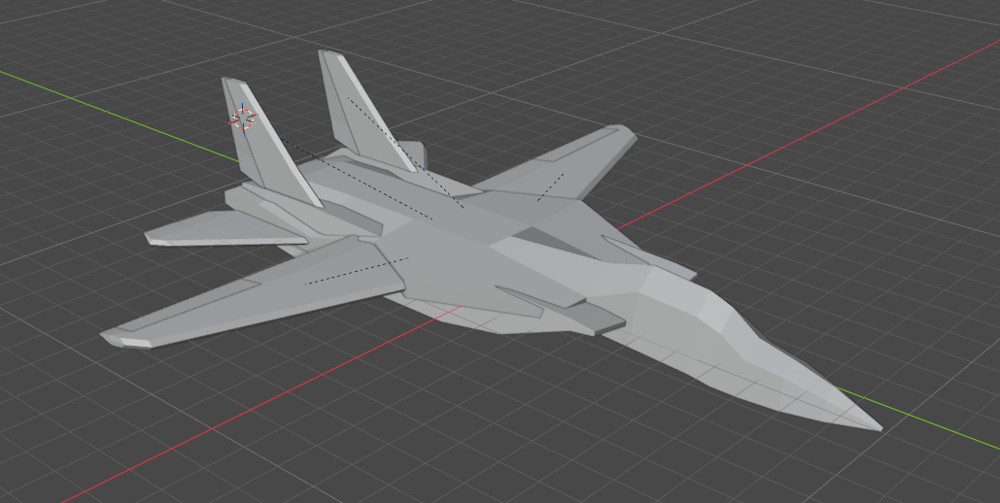
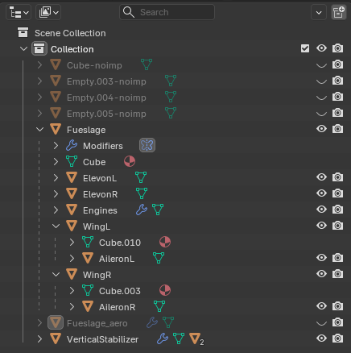
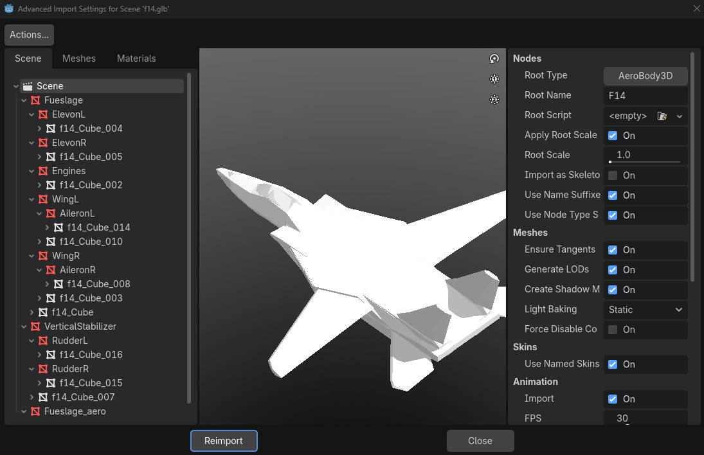
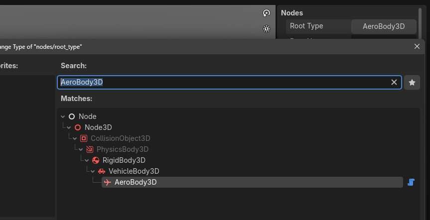
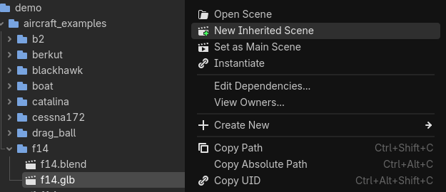
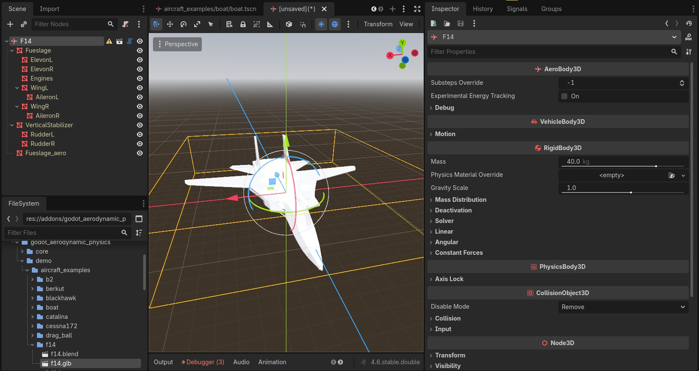
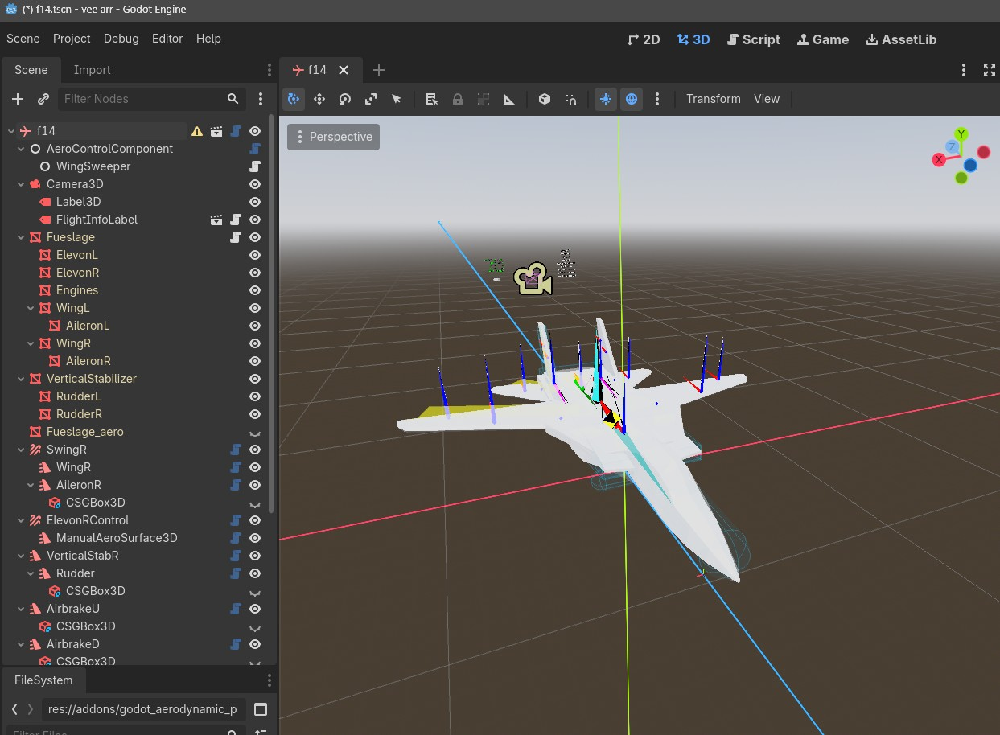

# Workflow

This is the aircraft creation workflow that I have adopted for this plugin. This is how the demo aircraft are configured, and how I suggest you configure your own custom aircraft.

# Using inherited scenes

Inherited scenes are one of the best workflow tools in Godot. Combined with [.blend file imports](https://docs.godotengine.org/en/4.1/tutorials/assets_pipeline/importing_scenes.html#importing-blend-files-directly-within-godot) it makes for a very quick asset iteration workflow.

### 1. Model configuration in Blender (or another modelling software):

My example will be done in blender, but the concepts are the same for .gltf exports from other software.

The F-14 Tomcat model is broken into separate meshes for different control surfaces and components (wings, ailerons, stabilators, rudders), and those meshes are parented (using Ctrl + P to reparent) in a hierarchy, in the same layout as you want them to appear inside Godot:

### 2. Import configuration:

Once you have a completed model, there are a few steps that will improve the editing process.

- Open the advanced import settings for your model by double-clicking the file in the Godot filesystem (.blend, .gltf, or .glb). This will bring up the Advanced 3D import settings.

- Set the root node type to AeroBody3D

- Click the `Reimport` button at the bottom.

### 3. Scene creation

Now, we will turn your model file (.blend, .gltf, .glb) into a Godot scene (.tscn):

- Find your model file in the Godot filesystem, right click it, and select `New Inherited Scene`

- Most of the scene should be configured, in the same way you organized the meshes inside Blender. Most importantly, the root node should be an `AeroBody3D`.

> Now would be a good time to add collision shapes, aero surfaces, control component, configure mass, etc. but I won't cover that here.

- Save the inherited scene. 

You can now use this custom aircraft like you would any other.

The benefit of this process is:

- Edits you make to the source model (.blend, .gltf, .glb) will be automatically updated in this inherited scene.
- Nodes configured in Godot will persist through asset updates (there are some caveats when objects are renamed or reparented inside Blender scene)
- Scripts can be added to the root node, or to the meshes imported from your asset.

> As a personal opinion, .blend imports combined with inherited scenes should be the primary way that you use with modeled assets in Godot.

After adding AeroSurfaces, AeroControlComponent, you will be left with a fully implemented aircraft.

> Note: Due to the aforementioned issues with node renaming and node reorganization on the Blender side, it's a good idea to avoid configuring nodes as children of the inherited nodes (inherited nodes are highlighted with yellow text)